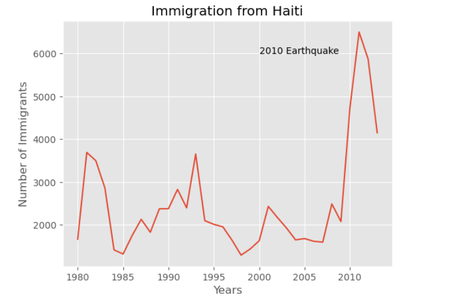
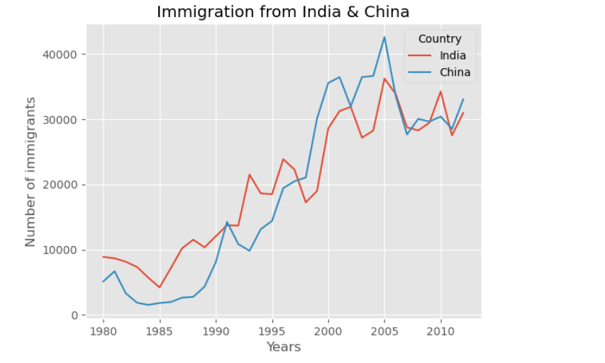
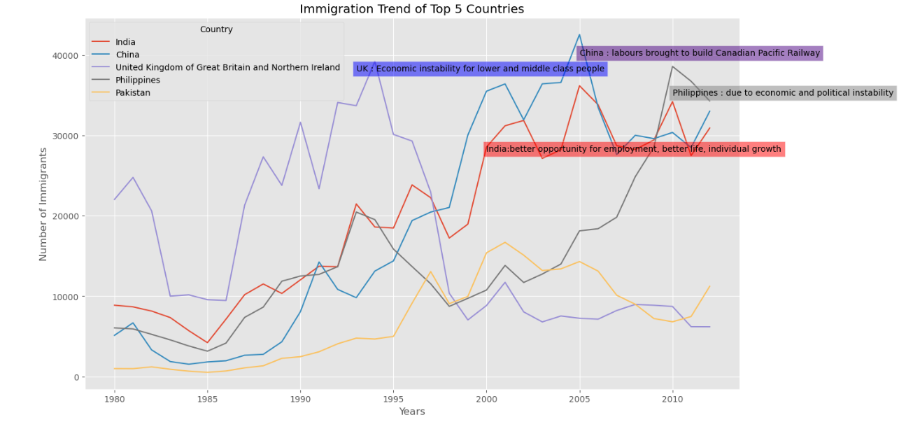
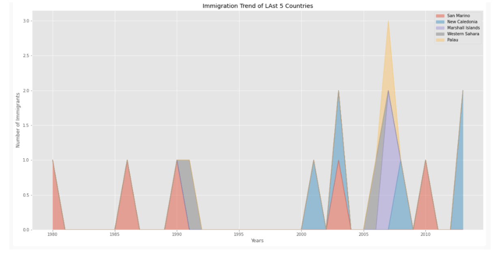
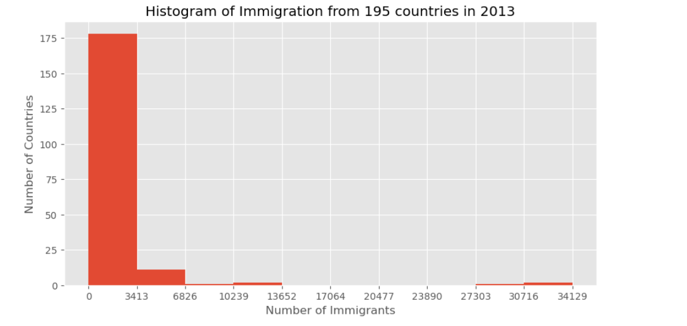
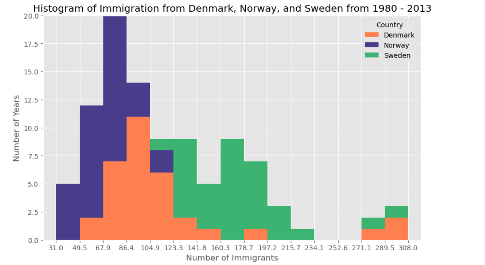
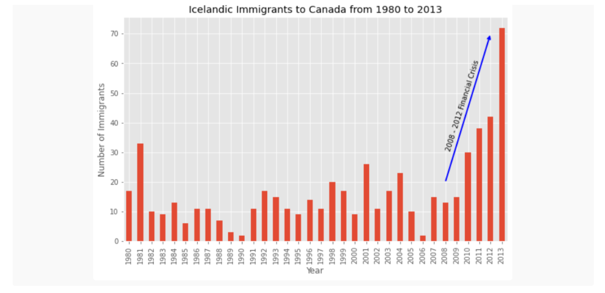

# Canada Immigration Analysis

## Introduction
	The project focuses on exploring and pre-processing a dataset detailing immigration to Canada, with the primary objective of gaining insights into immigration trends and demographics. This involves cleaning and transforming the data, conducting exploratory data analysis (EDA), and visualizing key insights using Pandas and Matplotlib. Through these efforts, the project seeks to provide a clearer understanding of the patterns and characteristics of immigration to Canada.
## Objective
	The objective of this project is to explore and pre-process a dataset containing information about immigration to Canada. The focus is on cleaning and transforming the data, conducting exploratory data analysis (EDA), and visualizing key insights using Pandas and Matplotlib. The aim is to gain a better understanding of immigration trends and demographics.
## Task
1. Import Dataset Using Pandas.

2. Data Wrangling.

3. Exploratory Data Analysis (EDA) and Pandas Intermediate.

4. Visualizing Data Using Matplotlib

5. Plotting in Pandas

## Data & Resource Used

**Dataset**

Option 1: [Kaggle](https://www.kaggle.com/datasets?fileType=csv)

Option 2: And, also the dataset can be found on [IBM](https://www.coursera.org/learn/python-for-data-visualization) Coursera Course. I am grateful for both Lecturer guidance on this project.

**Tools and Technologies** 

• Programming Language: Python

• Libraries: NumPy, Pandas, Matplotlib

• Environment: Anaconda - Jupyter Notebook

## Data Cleaning and Preparation
### 1. Import Dataset Using Pandas

	The dataset containing details about immigration to Canada is imported into the environment using the Pandas library. This step involves reading the data from a CSV file and loading it into a Pandas DataFrame for further processing.
### 2. Data Wrangling.

**Data Cleaning:**

o Handling missing or incomplete data by filling or removing null values.

o Ensuring data consistency by correcting data types and standardizing categorical data.

o Removing duplicate entries to maintain data integrity.

**Feature Engineering:**

o Creating new columns or modifying existing ones to better represent the data, such as aggregating data over specific time periods or categorizing countries into regions.

**Data Transformation:**

o Encoding categorical variables where necessary.

o Normalizing or scaling numerical features to standardize the data for analysis.

### 3. Exploratory Data Analysis (EDA) and Pandas Intermediate

**Indexing and Selection (Slicing):**

o Using advanced indexing and slicing techniques in Pandas to access specific subsets of the data. This includes selecting rows and columns based on labels, indices, and conditions.

**Filtering Based on a Criteria:**

o Filtering data based on specific criteria, such as selecting records for certain years, countries, or regions. This helps in focusing the analysis on particular aspects of the data.

**Sorting Values:**

o Sorting the Data Frame or Series by one or multiple columns to identify trends and patterns. For example, sorting immigration numbers in descending order to identify top source countries.

### 4. Visualizing Data Using Matplotlib

**Basic Plotting:**
	
o Creating various types of plots such as line plots, bar charts, and histograms to visualize trends and distributions in the data. These visualizations help in understanding the temporal and geographical patterns of immigration.

**Advanced Plotting:**
	
o Customizing plots with titles, labels, legends, and color schemes to enhance clarity and presentation. This includes setting plot styles and adjusting figure sizes for better visual appeal.

### 5. Plotting in Pandas

• Utilizing Pandas' built-in plotting capabilities to quickly generate visualizations directly from DataFrames. This includes:

o Line Plots: To show changes in immigration trends over time.

o Bar Plots: To compare immigration numbers across different countries or regions.

o Histograms: To display the distribution of immigration numbers.

## Data Analysis & Key Findings
### Plotting in pandas
• **Plot a line graph of immigration from Haiti.**

**Insight:** We can clearly notice how number of immigrants from Haiti spiked up from 2010 as Canada stepped up its efforts to accept refugees from Haiti. 

• **Comparing the number of immigrants from India and China from 1980 to 2013.**   

**Insight:** We can observe that the China and India have very similar immigration trends through the years.

  

• **Comparing the trend of top 5 countries that contributed the most to immigration to Canada.**   

**Insight:** Immigration from India and Philippines is still increasing, followed by china where as immigration from UK and Pakistan is ceasing.

  

• **Comparing the trend of last 5 countries that immigration to Canada using area plot.**   

**Insight:** We can see that San Marino, New Caledonia, Marshall Islands, Western Sahara, and Palau are the least contributing countries.
		
 

• **Finding the frequency distribution of the number (population) of new immigrants from the various countries to Canada in 2013.**   

**Insight:** Maximum frequency distribution of the number (population) in range 0 to 3413.

• **Finding the immigration distribution for Denmark, Norway, and Sweden for years 1980 - 2013.**   

**Insight:** Norway have highest immigration distribution. 

 

• **Comparing the number of Icelandic immigrants (country = 'Iceland') to Canada from year 1980 to 2013.**   

**Insight:** We can that financial crisis in between 2008 - 2012.

  

• **Exploring the proportion (percentage) of new immigrants grouped by continents for the entire time period from 1980 to 2013.**   

**Insight:** We can clearly see the percentage of immigrants grouped by continents.

 grouped by the decades 1980s, 1990s, and 2000s.**   

**Insight:** We can see the difference in each 10 years.

 for the years 1980 - 2013 using scatter plot.**   

**Insight:** We can clearly observe an upward trend in the data: as the years go by, the total number of immigrants increases.

![Alternative Text](assets/images/Findings Q11.png

• **Creating our own Choropleth map of the world depicting immigration from various countries to Canada.**   

**Insight:** Very few have less than 100 count.

![Alternative Text](assets/images/Findings Q12.png 

## Conclusion
	This project provides a comprehensive analysis of immigration data to Canada, utilizing robust data wrangling techniques and insightful visualizations. Through systematic EDA and the application of Pandas and Matplotlib functionalities, the project uncovers significant trends and patterns. The findings offer valuable insights into the demographics and dynamics of immigration, aiding policymakers and stakeholders in understanding the evolving landscape. The project adheres to professional data analysis standards, ensuring accuracy, clarity, and thorough documentation of the entire process.
## Recommended Analysis
	Future analyses could expand on this project by integrating additional datasets, such as economic indicators, employment rates, and educational backgrounds of immigrants, to provide a more nuanced understanding of the factors influencing immigration trends. Further exploration into regional and provincial differences in immigration patterns could also offer localized insights. Additionally, applying machine learning techniques for predictive modeling could help forecast future immigration trends based on historical data, providing valuable foresight for planning and policy development.
## Reflection
	This project has successfully demonstrated the importance of thorough data wrangling and detailed exploratory data analysis in extracting meaningful insights from complex datasets. By leveraging the capabilities of Pandas and Matplotlib, the analysis provided clear visualizations that highlighted key immigration trends and demographics in Canada. The project adhered to professional data analysis standards, ensuring a meticulous and accurate approach. The comprehensive documentation and clear presentation of findings serve as a solid foundation for future analyses, offering a valuable resource for stakeholders looking to understand and respond to the evolving immigration landscape.
